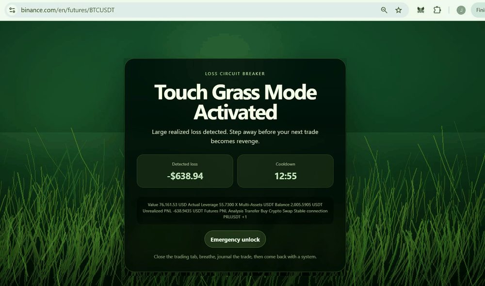

# Touch Grass Mode

> **Stop revenge trading. Touch grass instead.**
>
> A browser circuit breaker for revenge trading.



An open-source Chrome extension that blocks a trading page with animated swaying grass after a large realized loss is detected.

The real product is not the grass. The real product is a **local-first anti-revenge-trading circuit breaker** that puts a forced cooldown between you and the next click.

## Why this exists

Revenge trading is the moment right after a loss when traders chase it back, double size, or flip direction on tilt. The decision is emotional, the cost is real. Touch Grass Mode is a deliberate, dumb, in-your-face speed bump:

- Your PnL says you should stop.
- Your browser makes you touch grass.
- The cooldown does not care how you feel about it.

No coach, no signals, no copy trading, no leaderboard. Just a wall of grass between you and your next bad click.

## What it does

- Watches enabled trading domains in the browser.
- Scans visible page text for PnL-like labels such as `Realized PnL`, `Daily PnL`, and `Portfolio PnL`.
- Parses nearby negative money-like values.
- If the detected loss is below your threshold, it activates a full-screen grass overlay.
- The overlay persists on that domain until the cooldown expires.
- All data stays local in the browser.

## Important limitation

This MVP can detect losses only when PnL appears as **readable page text in the DOM**. It may not work if an exchange renders PnL inside canvas, iframe, protected shadow DOM, or an image. Support is **experimental**. Touch Grass Mode is a behavioral speed bump, not financial advice, not a trading system, and not a guarantee against loss.

## Privacy positioning

Touch Grass Mode is built so there is nothing to leak, because there is nothing collected.

- **No API keys.** The extension never asks for, accepts, or stores exchange API keys.
- **No backend.** There is no server. There is nothing to log into. There is no account.
- **No tracking.** No analytics, no telemetry, no remote scripts, no third-party SDKs, no pixels.
- **No credentials or seed phrases.** It will never request passwords, 2FA codes, wallet private keys, seed phrases, or personal identity documents. If anything ever asks you for those in the name of this extension, it is not this extension.
- **No trading execution.** The extension cannot place, cancel, or modify orders. It only reads visible page text and draws an overlay.
- **Local-only state.** Settings live in `chrome.storage.sync`. Cooldown state lives in `chrome.storage.local`. Nothing leaves the browser.

If you can read the source, you can verify all of the above. That is the point.

## Install locally

1. Clone or download this repo.
2. Open Chrome.
3. Go to `chrome://extensions`.
4. Enable **Developer Mode**.
5. Click **Load unpacked**.
6. Select this repo folder.
7. Open a supported trading page.
8. Click the Touch Grass Mode extension icon.
9. Click **Enable current site**.
10. Click **Check support**.
11. Use **Test overlay** to verify that the grass block works.

## Repository layout

- `manifest.json` - Chrome Manifest V3 entrypoint.
- `src/background.js` - installs default local settings.
- `src/content.js` - local DOM text scanner, PnL parser, cooldown state, and overlay controller.
- `src/popup.*` - extension popup actions.
- `src/options.*` - settings UI backed by `chrome.storage.sync`.
- `src/overlay.css` - animated grass overlay styles.
- `assets/` - README media (e.g. demo GIF).
- `scripts/smoke-test.js` - agent-friendly static checks.
- `scripts/package.sh` - optional zip packaging helper.

## Configure

Open the extension options page and set:

- Loss threshold in USD
- Cooldown duration
- Emergency unlock delay
- Enabled domains
- PnL keywords

## Support matrix

| Exchange / Site | Status | Detection method | Notes |
|---|---:|---|---|
| Hyperliquid | Experimental | DOM text scan | Default enabled domain is `app.hyperliquid.xyz`. Test before relying on it. |
| Binance | Not tested | TBD | Add domain and PnL keywords manually. |
| Bybit | Not tested | TBD | Add domain and PnL keywords manually. |
| OKX | Not tested | TBD | Add domain and PnL keywords manually. |
| Unknown sites | Experimental | Generic DOM text scan | Works only if PnL is visible as normal page text. |

## Suggested overlay messages

The overlay is the moment of intervention. Short, blunt, and not preachy works best. A few drop-in lines suitable for the extension or marketing copy:

- "Touch grass. The market will still be here in 30 minutes."
- "This is the trade that wipes the account. Walk away."
- "You are tilted. Your PnL agrees. Cooldown active."
- "Revenge trading is a tax on bad feelings. Pay it later. Or never."
- "Close the laptop. Drink water. Come back when your hands are not shaking."
- "The setup you are about to take did not exist five minutes ago."
- "Your edge is not in the next click. Your edge is in the next hour of not clicking."
- "Green grass beats red candles. Stay outside."
- "If this trade is so good, it will still be good after the cooldown."
- "Discipline is just the cooldown you set for yourself. This is that cooldown."

These lines are intentionally low-stakes and non-financial. They are not advice. They exist to interrupt momentum.

## Privacy (technical)

Touch Grass Mode does not collect, transmit, sell, or externally store trading data.

- No backend
- No analytics
- No remote scripts
- No credential collection
- No API key, seed phrase, 2FA, password, or personal document handling
- No trading execution
- Settings are stored with `chrome.storage.sync`
- Cooldown state is stored with `chrome.storage.local`

## Agent usage

Agents should read `SKILL.md` first, then run:

```bash
node scripts/smoke-test.js
```

The expected agent flow is:

1. Clone repo.
2. Inspect `manifest.json`.
3. Run the smoke test above.
4. Load unpacked extension or package it.
5. Help user configure domains and PnL keywords.
6. Run support check on the target trading site.
7. Do not ask for API keys, wallet keys, exchange credentials, 2FA codes, personal documents, or seed phrases.

## Local validation

This project has no build step. A basic agent-safe validation pass is:

```bash
node scripts/smoke-test.js
```

Manual acceptance testing still requires Chrome:

- Load the repo folder via `chrome://extensions` -> Developer Mode -> Load unpacked.
- Confirm the popup opens.
- Save settings in Options.
- Enable the current site from the popup.
- Run Check support on a page with visible PnL-like text.
- Run Test overlay, verify countdown, refresh persistence, emergency unlock, and cooldown expiry.

## Roadmap

- Exchange-specific adapters.
- Better PnL parsing.
- Loss journaling panel.
- Daily lockout mode.
- Optional Web Store-ready permission model.
- More realistic grass animation.
- Breathing timer during cooldown.

## Disclaimer

Touch Grass Mode is a behavioral tool. It is not financial advice, not investment advice, and not a substitute for risk management, position sizing, or talking to a human. Detection is best-effort against the visible DOM and may silently fail on a given exchange. You are responsible for your trades. The grass is just there to slow you down.
